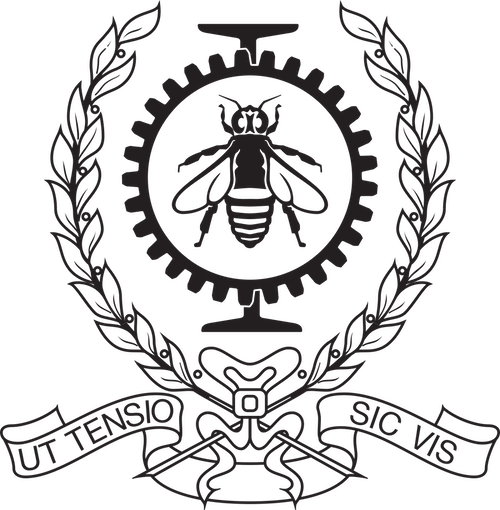

# Collaboration avec Polytechnique

Pour une deuxième année, ce cours est jumelé avec le cours [INF8808](https://www.polymtl.ca/etudes/cours/visualisation-de-donnees) de Polytechnique Montréal donné par le professeur [Thomas Hurtut](http://www.professeurs.polymtl.ca/thomas.hurtut/).

Cela signifique que certain\(e\)s d'entre vous pourrez être pairé\(e\) avec un\(e\) étudiant\(e\) en génie logiciel pour réaliser votre travail final.

Le cours de Thomas est intitulé «Visualisation de données». Ainsi, dans une éventuelle équipe UQAM-Poly, votre rôle sera de trouver des données intéressantes et originales, celui de l'étudiant\(e\) de Poly sera d'en faire une visualisation tout aussi intéressante et originale.

Cette collaboration n'est **pas obligatoire**. Un maximum de 10 étudiant\(e\)s pourront s'en prévaloir. Elle vient avec des avantages \(un travail final plus léché; l'expérience d'une collaboration comme il s'en fait de plus en plus dans les médias; possibilité de puiser dans un «panier à idées»\), mais aussi avec des inconvénients \(exigences plus grandes sur le plan de la correction; l'étudiant\(e\) de Poly notera une partie de votre travail; échéances plus serrées\).

Si vous souhaitez être pairé\(e\) avec un\(e\) collègue informaticien\(ne\), il faudra vous manifester avant:

#### le 20 janvier 2020. 👈 

