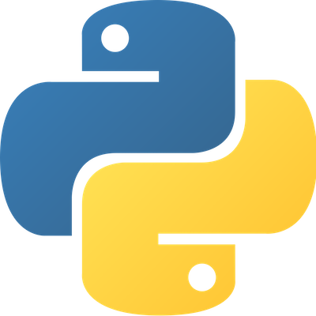

# Objectifs

L'objectif principal de ce cours est de vous initier à la **programmation** et à ses usages journalistiques.

Le langage que vous apprendrez s'appelle [**Python**](https://www.python.org/).

Plus concrètement, on s'en servira pour :

* **moissonner** des données, ou faire du _data scraping,_
* faire du **traitement du langage naturel** \(ou _Natural Language Processing \[NLP\]_\), ce qui est considéré par certains comme une forme d'intelligence artificielle
* **analyser** des données lorsqu'elles sont trop volumineuses pour un tableur comme _Excel_ ou _Calc_ de LibreOffice.

Certaines et certains pourront également avoir pour objectif de travailler en équipe avec un\(e\) véritable informaticien\(ne\). En effet, pour une deuxième année, nous allons pouvoir collaborer avec les étudiant\(e\)s du professeur [Thomas Hurtut de Polytechnique Montréal](http://www.professeurs.polymtl.ca/thomas.hurtut/). Cette collaboration n'est pas obligatoire. Mais si vous le souhaitez, vous pourrez être pairé\(e\) avec un\(e\) étudiant\(e\) de Poly pour faire votre travail final. Cette collaboration pourrait donner un projet plus intéressant, mais viendra avec de plus grandes exigences au plan de la correction.

Plusieurs des outils que nous utiliserons dans le cadre de ce cours sont à code source libre et devraient fonctionner autant sur Mac que sur PC avec Windows. **Mais il va sans dire que posséder un ordinateur est incontournable pour suivre ce cours.**

